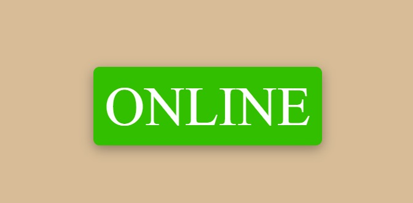

# Internet-Connection-Checker

Check the Status of your Internet connection using HTML, CSS, JavaScript

If you are connected to the internet, you will see:

On hover you will be able to see the internet provider:

If you are not connected to the internet, you will see:

